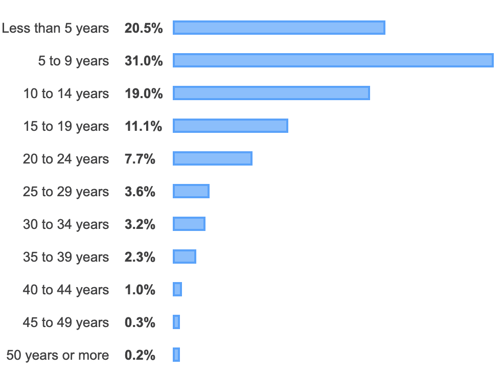
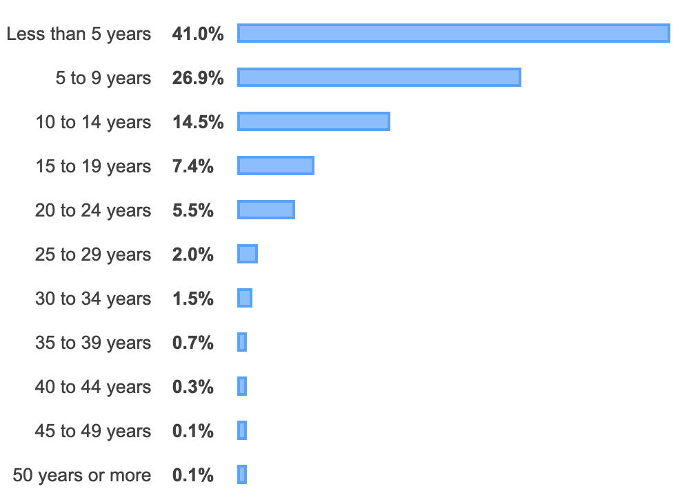
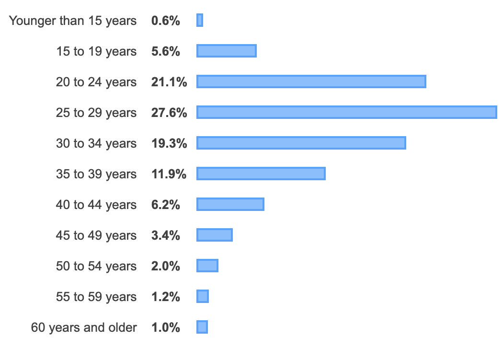
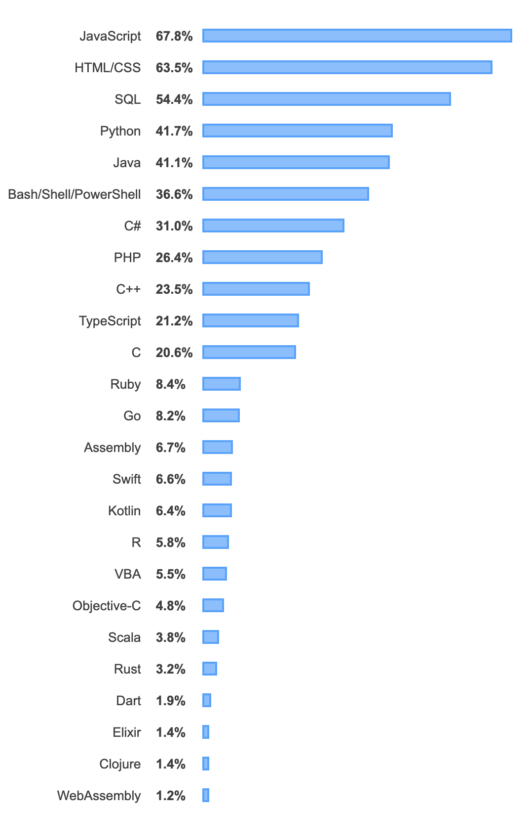
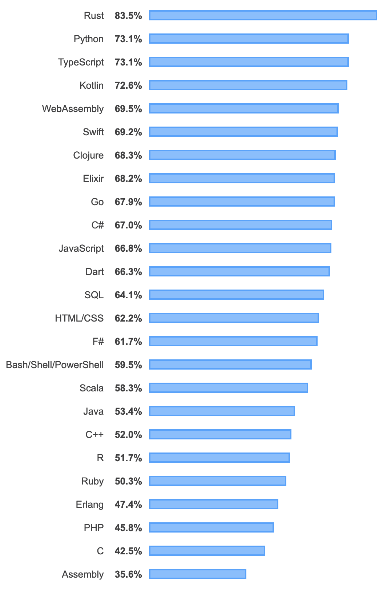
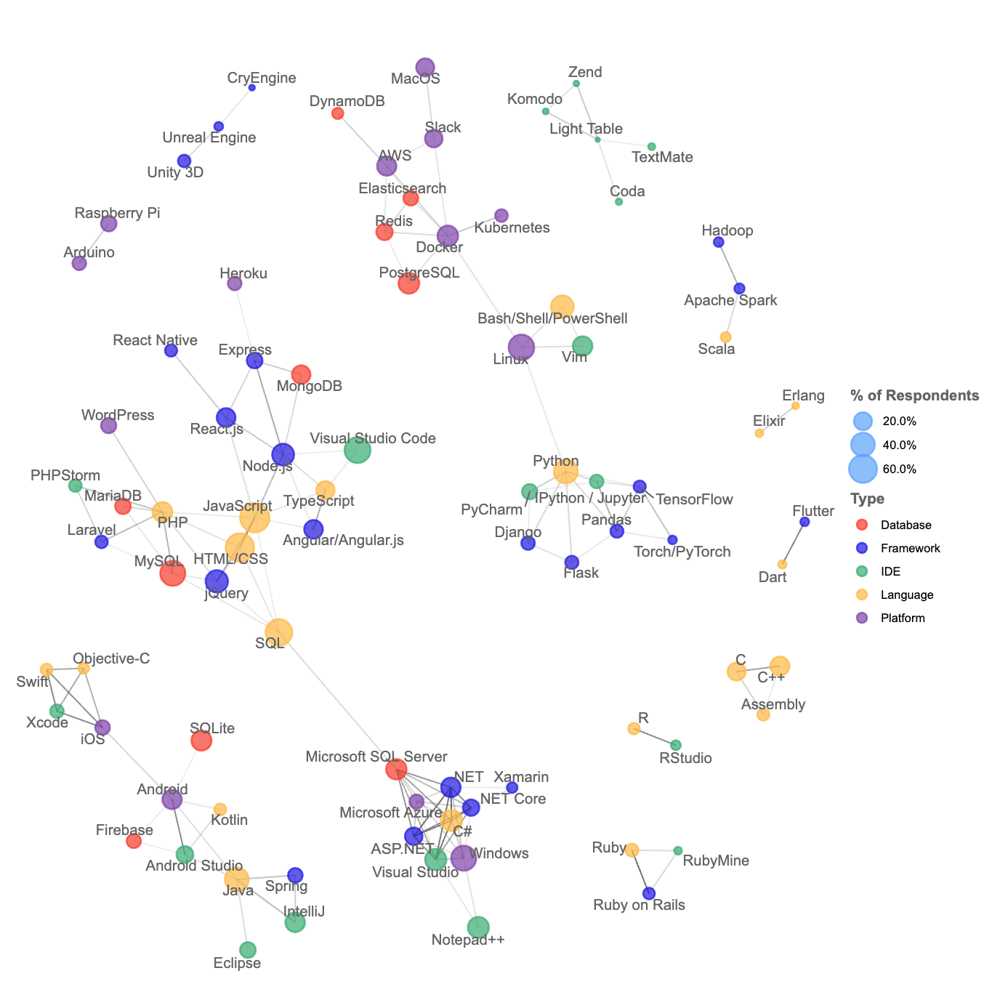
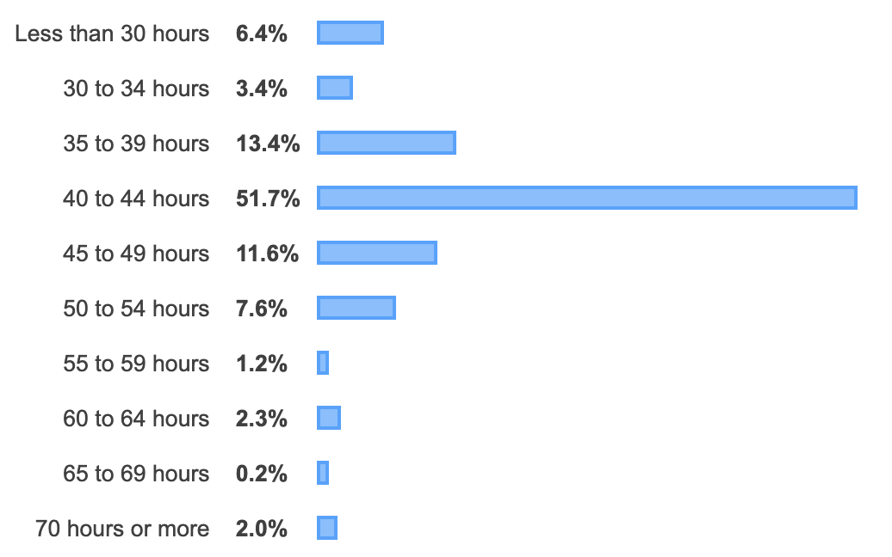

# 对于 《StackOverflow 2019程序员调查报告》的一些感想

前些天，StackOverflow 发布了 [2019年的年度程序员调查](https://insights.stackoverflow.com/survey/2019)，这个调查报查有9万名程序员参与，这份调度报告平均花了20分钟，可见，这份报告有很多的问题，也是很详细的。这份报告有一些地方，让我有了一些思考。

首先，我们先来看一下之份报告的 Key Results：

- Python 成为了过去一年中成长最快的语言，把Java挤到了第二位，排在后面的是Rust语言。
- 有半数以上的被访者在是在16岁写下自己的第一行代码。
- [DevOps Specialists](https://stackoverflow.com/jobs/devops-jobs) 和 Site Reliability Engineers 是程序员中最有经验，技术最牛，薪资最好的职位。（这对应于国内的——系统架构师）
- 在几个头部的程序员大国中，中国的程序员最乐观的，他们相信在今天出生的人会有比他们父母更好的人生。对于欧洲的程序员来说，比较法国和德国的程序员，他们对未来并不太乐观。
- 对于最影响程序员生产力的事，不同的程序员有不同的想法。

## 第一部分，Developer Profile

在第一部分中，我们可以看到，中国程序员参与这个调查的并不多，程序员主要集中在美国、欧洲、印度这三个地方。所以，这份报告更偏国际上一些。这对于我们中国程序员也有很大的帮助，因为一方面可以看到世界发展的趋势，另一方面也可以了解我们和世界有什么不一样。

对于技术职业来说，整个世界的程序员开始趋于全栈和后端，有51.9%的人是全栈，50%的人是后端，32.8%的人是前端……在这些人中，很多程序员都选了多项，中位数是3项，最常见是前端、后端和全栈全选的。然后，接下来是选两项的，选两项目的包括：数据库管理员和系统管理员，DevOps Specialist 和 Site Reliablility Engineer， 学术研究者和科学家，设计师和前端工程师。

从这些数据中我们可以看见：**前后端的界限越来越不明显，设计师和前端的界限也开始模糊。这应该说明，工具和框架的成熟，让后端程序员和设计师也可以进入到前端工程师的领域，或是前端工程师开始进入后端和设计的领域**。总之，复合型人才越来越越成为主流，而前后端也趋于一个相互融合的态势。

在接下来的图表中，我们可以看到有80%以上的人是把编程当成自己的爱好（包括相关的女性）。

真是应了那句话——“Programmers who don’t code in their spare time for fun will never become as good as those that do”，是的，如果你对编程没有感到一种快乐，没有在你空闲的时候去以一种的兴趣爱好方式去面对，那么，无论是编程，还是运动，还是去旅游，都不会有太多成效的。

在接下来的编程经验上，有两组如下的数据：

|学习编程的年限|编程的年限|
|---|---|
| ||

我们可以看到无论是学习还是编程，随着时间的拉长，其人数占比越来越少。

下面我们再来看一个年龄图：

调查报告从20岁开始每隔5年划分一个年龄段，我们不难发现从25-29岁开始每个年龄段都比前一个年龄段人数急剧减少大约30-50%，比如25-29年龄段占总人数27.6%，而30-34则只有19.3%。以此类推，到60岁以上，就只剩1%。可以看出5年是大多数程序员的转型周期。这是合理的，因为5年时间足够一个人积累足够的经验技能为职业转型做准备。

我们也可以看到50岁以上的程序员只有4.2%，大约是参与调查人员的300多人，如果这些人20岁左右参加工作，那么说明他们在1990左右就开始写代码，事实上那个时间点别说是程序员了，连电脑用户都不多。**电脑和互联网真正暴发的时间还是在1995年 - 2000年之间，不过，那个时间点程序员的总体人数也不多，而行业越来越火才会导致大量的人进入到这个行业中，这个转换过程基本上去需要3-5年，也就是从2000年后才开始有大量的人拥入程序员这个行业，程序员的人数在过去30年间也是呈增涨态势的，所以，我个人认为，所谓的“众多老程序员”的比例会被2005年以后大量拥入程序员行业的年青人所“稀释”。所以，上图的比例不能完全说明程序员是个青春饭**。

但是，我们还是要正视老牌资深的程序员越来越少的这个事实，在这份报告第三部分中说了一些和程序员职业生涯相关的调查，如下：

- **在被问到有多少人对自己的职业满意的时**。有40%的人觉得很满意，而有34.3%的人觉得一般满意，有10%的人说不清，还有15%的人是不满意的。可以看到有不少人是对这个职业生涯是有想法的。

- **在被问到有多少人想转管理而可以挣得更多时**。有30%的人是说想转的，有51%的人是明确不转的，还有20%的人是说不知道。可见，想转管理的人最多可能会有一半的人。

- **在被问到有多少人想转管理时**。有1/3的人是明确不想转的，而有1/4的人是明确是想转，而有36%的人则是不说，观望中。可见，的确是有很多想想转管理的。

**我们可以看到，程序员中并不是所有的人都是可以坚持这么长时间的，这也挺正常的，对很大一部分人来说，对这个职业是有或多或少的不满意的，也有一部分人可能会随着技术的更新被淘汰，还有另外很大一部分人是想转管理的。所以，能够长时间地跟上形势长时间地喜欢写代码，并且对程序员这个的职业长期满意，不想转管理的，的确是为随时年龄的越大也越来越少**。

**但我们完全可以看出来，程序员的主力军在20-40岁这个区间，而30岁左右的程序员是年富力强（经验和能力都很好）的黄金时间**。

--------

老程序员在国外似乎不会存在多大的问题，但在国内会有一些问题，所以，对于像我一样喜欢写代码、打算长久做程序员的兄弟，这里分享一些相关的经验。

1. **持续高效地学习**。软件行业的新技术层出不穷，旧的技术淘汰很快，所以我们更要多多学习基础技术和原理，那些都是很难改变的，并且基础扎实了后，学习新的技术也才会更快速。其间我们也不要乱学新技术，我们要关注那些有潜力的技术，也就看准了再学（参看酷壳的《[Go语言、Docker和新技术](https://coolshell.cn/articles/18190.html)》）。注意，而是跟上大时代已经比较不容易，引领时代的人还是少数，所以，还是要更为高效地学习。

2. **积极面对他人的不解**。 很多时候，总是会有人说：“到了你这个年纪怎么还在做程序员？”，这句话感觉就是对程序员这个职业的一种羞辱，社会的价值观感觉容不下大龄程序员。这个时候，我一般会跟他们解释到，我40来岁了，我觉得自己的状态还很好，工作完成没什么问题，偶尔加班到凌晨也行，新知识和技术我学起来不比年轻人慢，我在这个年纪有的经验比他们都多，而且，我这个年纪还在写代码，说明我真的喜欢这个事，**像我这样的人能够长时间坚持做一个职业的人这个世界已经不多了，你们应该珍惜……**

3. **找到自己的定位**。我们需要做好职业规划、财务和心理方面的准备。40岁的程序员，所能竞争的一定是自己的认识和经验，所以，40岁以后如果你还是很喜欢这一行业，你的社会阅历和经历以及对这个社会的理解，可以让你做一些有创新的事，除此之外，你还可以做一个教练、老师、咨询、专家……，用你的经验和能力帮助下一代和一些中小型的公司，这不但是他们的刚需，同时也会让重新焕发的。

## 第二部分，技术

首先，在这部分，主要是了解一些技术，这部分的技术可以给于程序员们一些指导。

|最流行的语言|最热门的语言|
|----|----|
| | |

我们可以看到，

- Javascript/HTML/CSS是很多人都会用到的，后面的是SQL，这个也没什么问题，无论前后端的人，或多或少都会要用到的，这些技术感觉已经成为了基础必会的技术了，就像数中的加减乘除一样。

- Python/Java/Shell 是后端开发主流语言的前三强，Python在今年超过了Java。这里让我比较好奇的是居然还有很多人用Shell，这估计跟运维有关，所以，Python的热可能也是通过运维和大数据相关。

- 流行语言后，第二梯队的是 C# / PHP / C++ / TypeScript / C ，接下来的是： Ruby / Go / Swift / Kotlin /WebAssembly / Rust... 。但在最被程序员喜欢的编程语言中：Rust / Python / TypeScript / Koltin / WebAssembly / Swift / Go... 都是排在前几名的。**程序语言每隔一段时间就会整出一些新的语言来，我们一定要明白新出来的东西主要是为了解决什么样的问题，不然很容易迷失。**

- 在后面还有一个编程语言的薪资图，我们可以看到，在上面被提过的这些个编程语言中，**Go语言的薪资是最高的（这可能是因为Go语言写关键的系统级的中件间——因为Go语言正在成为云计算的第一编程语言）**，然后是Scala、Ruby、WebAssembly、Rust、Erlang、Shell、Python、Typescript…… 

**通过这些个信息，我们可以看出主流技术、有潜力的技术，传统过气技术，以及相关薪资，对我们在选择编程语言上有一定的启示。**

在后面，我们可以看到:

- 在 Web 开发框架上，主流使用还是 jQuery, React.js，Angular.js 为最前面的三个前端开发框架。而被程序员所喜欢的则是 React.js，Vue.js，Express, Spring，程序员非常不喜欢 Drupal，jQuery，Ruby on Rails 和Angular.js……

- 在其它开发框架/库/工具上，主流是Node.js、.NET、Pandas、Unity 3D、Tensorflow、Ansible、Cordova、Xamarin……而程序员比较喜欢的是.NET、Torch/PyTorch、Flutter、Pandas、Tensorflow、Node.js ... 

- 在操作系统上，主流使用Linux、Windows、Docker、Android、AWS……，而程序员最喜欢的是Linux、Docker、Kubernetes、Raspberry Pi、AWS、MacOS、iOS……

- 在数据库上，MySQL、PostgreSQL、MSSQL、SQLite、MongoDB、Redis、Elasticsearch是比较主流的，而程序员非常喜欢的是，Redis、PostgreSQL、Elasticsearch、Firebase、MongoDB……，程序员比较讨厌的是 Couchbase、Oracle、Cassandra、MySQL。

**从这些个图表中，我们可以看到主流和有潜力的技术是什么，我们可以看到 Windows 的技术并没有过时，感觉似乎都有可能会卷土重来，但是，开源的技术来势凶凶，正在吞食整个软件业，不容小觑，Docker/Kubernetes无论是在主流应用上还是被程序员的喜好上都是非常猛的，而云平台的AWS开始成为标准平台技术……**

接下来的开发工具中，我们可以看到：

- Visual Studio Code 成为了最流行的开发工具。让我没有想到的是跟在后面的是 Notepad++（好久没用这个工具了，我得找回来用用了），而IntelliJ、Vim、Sublime Text排以后面。 Eclipse 和 Atom 动力不足，Emacs 开始变得小众了。

- 程序员主要的开发平台还是Windows占了近1/2， MacOS和Linux随后，各占1/4。

- 有38%的人使用容器技术做开发，30%的人使用容器做测试，在生产线上使用容器的有26%

**看样子编程开发工具还是Visual Studio 和 IntelliJ的天下，MacOS/Linux正在抢Windows的开发市场**

接下来，StackOverflow给了一个技术圈的图

从上面这个图中，我们可以看以技术的几圈子：

- **Microsoft圈** - Windows、.NET、ASP.NET、C#、Azure、SQL Server
- **Java圈** - Java、Spring
- **手机圈** - Android、 iOS、Kotlin、Swift、Firebase
- **前端圈** - Javascript、React.js、Angular.js、PHP
- **大数据圈** - Python、TensorFlow、Torch/PyTorch
- **基础平台圈** - Linux、Shell、Vim、Docker、Kubernetes、Elasticsearch、Redis……
- **其它圈子** - C/C++/汇编圈子、Ruby圈子、Hadoop/Spark圈子、……

**看到谁的圈子大了吧，圈子大的并不代表技术实力强或是有前途，不过可以代表在那个圈子相关的关联技术，一方面，可以给你一些相关的参考，另一方面，整体可以让你看到全部的目前比较主流的技术。**

## 第三部份 工作

在第三部份工作中，我们可以看到如下的一些数据：

- 有3/4的程序员是全职的，10%左右的程序员是自由职业，6%左右的程序员是失业的，这个比例在北美、印度和欧洲都差不多。

- 有1/3的人在过去一年内换过工作，1/4的人在过去1-2年间换过工作，1/3的人在2-4年换过工作。

- 程序员找工作时，影响程序员的几个主要因素是：技术（编程语言、框架和使用的技术）、办公环境和公司文化、灵活的时间和安排、更专业的机会、远程工作……

- 影响程序员工作的几大因素是：有干扰的工作环境、开会、要干一些和开发无关的事、人手不够、管理不够、工具不够、通勤时间……

- 对于工程质量，有近70%的人有Code Review，而30%的则没有；有60%多的人有Unit Test，而不到40%的没有……

**从工作中我们可以看到，程序员还是比较关心技术和公司文化的，换工作也是这个职业很正常的特性，他们并不喜欢被打扰，希望有足够的时间，而对于工程质量还是很有追求的。**

最后用一张程序员的“**每周工作时间**” 来结束本文！

祝大家编程快乐！

（全文完）

